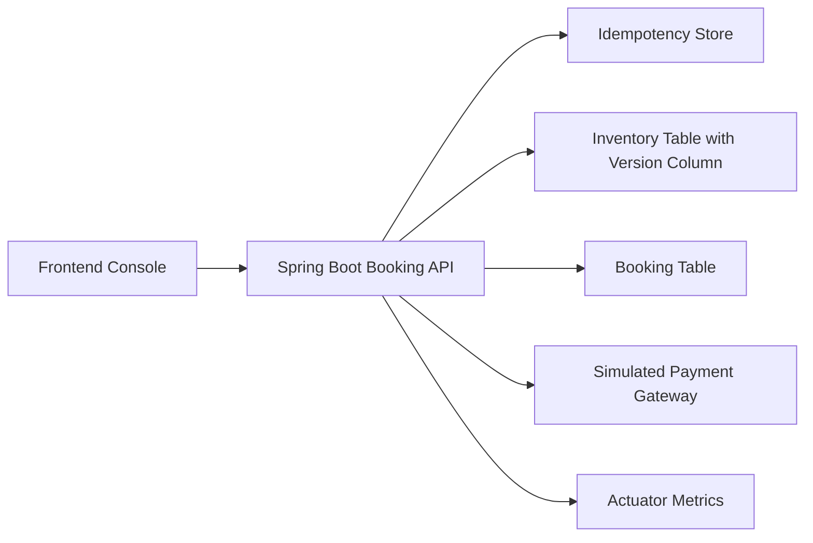
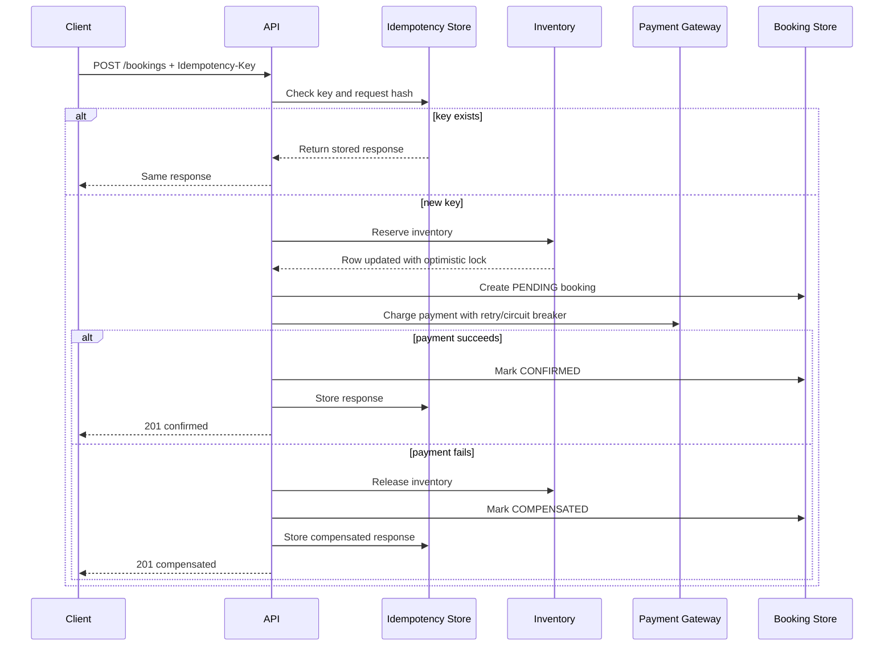

# System Design

## Problem

Build a booking service for flights, hotels, or rooms where inventory is scarce, requests may be retried, and downstream services can fail. The user-facing promise is simple: a confirmed booking should reserve exactly what the customer bought, and a failed booking should not leak inventory or create duplicate charges.

## Functional Requirements

- Search/list bookable inventory.
- Create a booking for one or more units of inventory.
- Make booking creation idempotent for client retries.
- Prevent overselling under concurrent demand.
- Charge a customer through a payment provider.
- Confirm the booking only after successful payment.
- Compensate inventory reservation if payment fails.
- Expose status for customer support and reconciliation.

## Non-Functional Requirements

- High correctness for inventory and payment state.
- Low-latency booking confirmation for common paths.
- Graceful degradation when payment or supplier systems are flaky.
- Observable behavior through metrics, logs, and traces.
- Scalable architecture for read-heavy search and bursty booking traffic.

## Current Architecture

## Booking Saga

## Data Model

- `inventory_item`: bookable SKU, type, price, available quantity, and `version`.
- `booking`: customer request, amount, payment reference, status, failure reason.
- `idempotency_record`: request key, request hash, status code, response body.

In a production system the idempotency table should also include expiry, tenant/user scope, created source, and encrypted metadata.

## Scaling Plan

### API Layer

Run many stateless Spring Boot instances behind a load balancer. Idempotency and locking are enforced in the database, so retries can land on any instance.

### Database

Start with PostgreSQL primary plus read replicas. Keep writes for booking creation on the primary. Partition high-volume tables by time or tenant. Use partial indexes for active bookings and unique indexes for idempotency keys.

### Inventory

For very hot inventory, move from a single row counter to sharded counters or supplier-owned reservation tokens. The current optimistic-lock design is excellent for correctness and moderate concurrency, but under flash-sale traffic it may create retry storms on one hot row.

### Queues and Events

Add Kafka, RabbitMQ, or AWS SQS/SNS for:

- booking-created events
- payment-authorized events
- supplier-confirmed events
- compensation-required events
- analytics and notification fanout

Use the transactional outbox pattern so database writes and event publication do not drift.

### Payments

Real payment providers require idempotency at the payment edge too. The booking id or payment attempt id should be sent as the provider idempotency key. Store payment attempts separately from bookings for auditability.

### Search

Search inventory should not hit the booking write database directly at scale. Use Elasticsearch/OpenSearch for availability search, backed by events from the inventory service. Treat search availability as approximate and booking inventory as authoritative.

### Analytics

Stream domain events into a warehouse such as BigQuery, Snowflake, or Redshift. Build metrics for conversion funnel, supplier failures, compensation rate, payment declines, fraud signals, and inventory contention.

### Caching

Use Redis for read-heavy inventory metadata, feature flags, rate limits, and short-lived idempotency fast-path caching. Do not rely only on Redis for final inventory correctness unless it is paired with a durable reservation ledger.

## Observability

- Actuator health and metrics are enabled.
- Prometheus can scrape `/actuator/prometheus`.
- Add distributed tracing with OpenTelemetry for production.
- Recommended dashboards: booking latency, payment failure rate, circuit breaker state, optimistic-lock conflict rate, compensation rate, and idempotency replay count.
